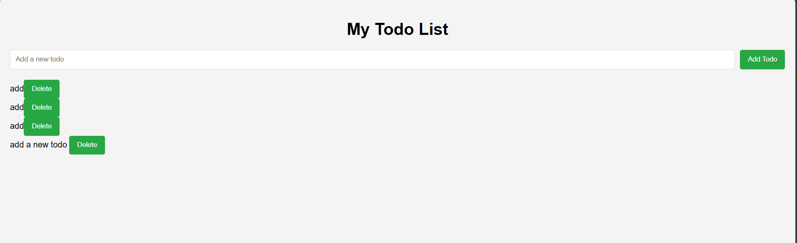
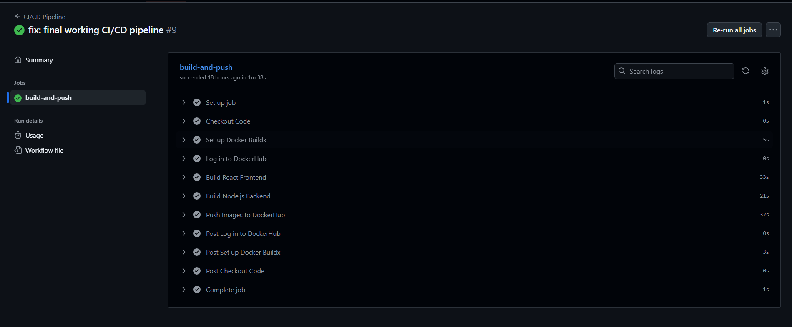
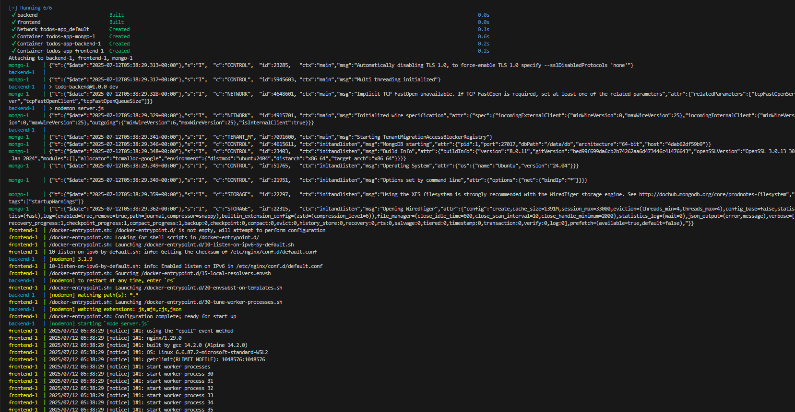
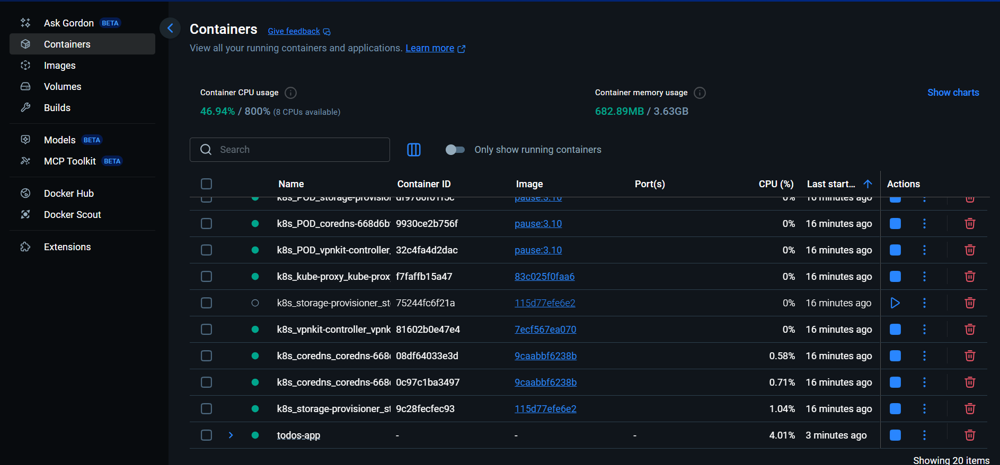
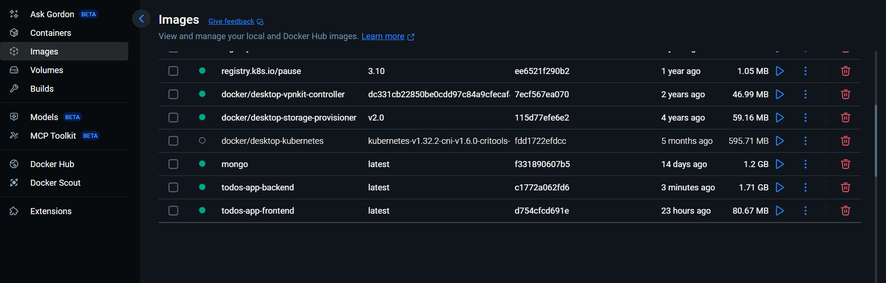
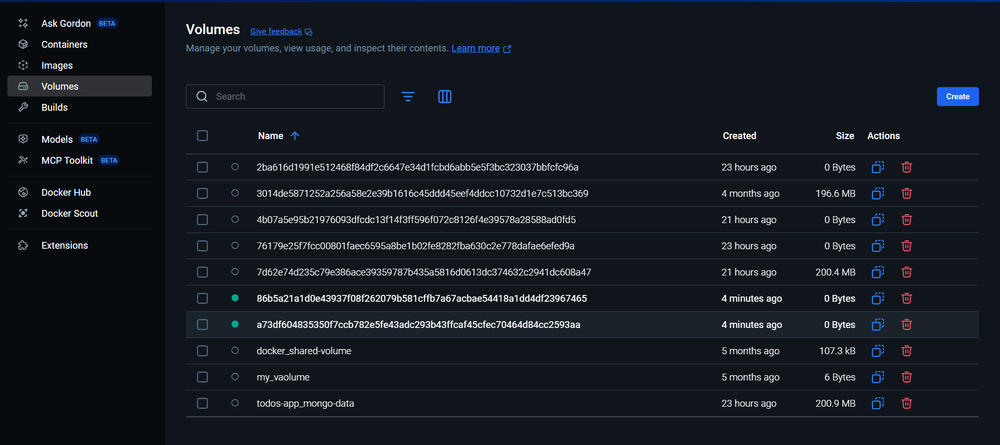
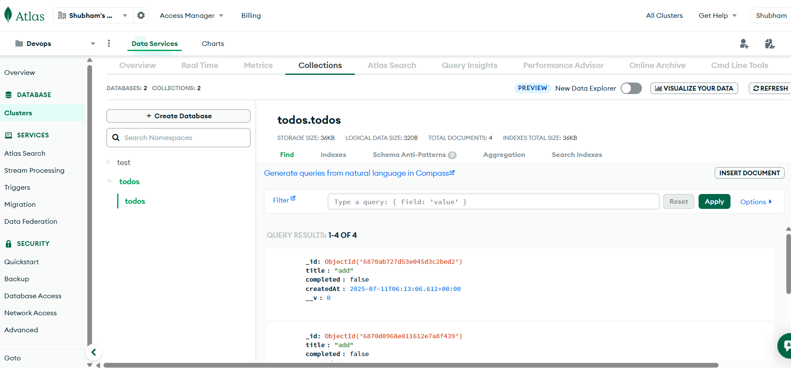
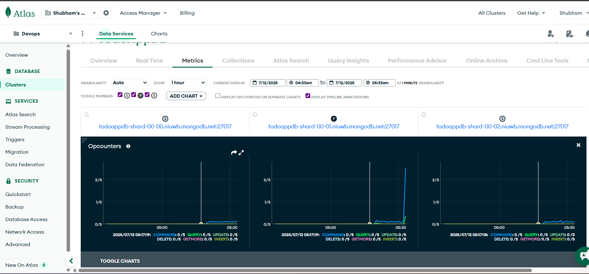

# 📝 Todos App

A full-stack Todo Application with backend APIs using **Node.js, Express, MongoDB**, and frontend built with **React**. The app is containerized using **Docker** and deployed via **GitHub Actions CI/CD pipeline**.

---

## 🔧 Tech Stack

**Frontend**: React, CSS  
**Backend**: Node.js, Express.js, MongoDB  
**Testing**: Jest, Supertest  
**DevOps**: Docker, GitHub Actions  
**CI/CD**: GitHub Actions for building and pushing Docker images

---

## 📁 Folder Structure

```
Todos-app-main/
├── todo-frontend/        # React frontend
│   ├── public/
│   ├── src/
│   ├── Dockerfile
│   └── ...
├── todo-backend/         # Express backend
│   ├── controllers/
│   ├── models/
│   ├── routes/
│   ├── utils/
│   ├── __tests__/        # Unit & Integration tests
│   ├── Dockerfile
│   └── server.js
├── docker-compose.yml    # Docker orchestration
└── .github/workflows/    # CI/CD pipeline
```

---

## 🚀 Getting Started

### 🐳 Run with Docker

```bash
docker-compose up --build
```

App will be available at:

- Frontend: `http://localhost:3000`
- Backend API: `http://localhost:3002/get-todos`

> Make sure Docker is installed and running.

---

### 💻 Run Locally (Without Docker)

#### Backend

```bash
cd todo-backend
npm install
npm run dev
```

#### Frontend

```bash
cd todo-frontend
npm install
npm start
```

---

## 🧪 Testing

```bash
# From todo-backend directory
npm test
```

Includes both unit and integration tests using **Jest** and **Supertest**.

---

## ⚙️ CI/CD Pipeline

CI/CD is configured using GitHub Actions:

- On every push to `main`:
  - Lint & test the backend
  - Build Docker images
  - Push to Docker Hub

---

## 🔐 Docker Hub Credentials Setup

To push Docker images from GitHub Actions to Docker Hub:

1. Go to your GitHub repository.
2. Navigate to **Settings > Secrets and variables > Actions**.
3. Click **"New repository secret"**.
4. Add the following secrets:
   - `DOCKER_USERNAME` – your Docker Hub username
   - `DOCKER_ACCESS_TOKEN` – your Docker Hub access token (generate it from Docker Hub under *Account Settings > Security > New Access Token*)

These secrets are securely used in the GitHub Actions workflow to authenticate with Docker Hub and push Docker images.

> Workflow file: `.github/workflows/ci-cd.yml`

---

## 📸 Screenshots

### 1. Add Todo  


### 2. CI/CD Pipeline  


### 3. Docker Build  


### 4. Docker Container  


### 5. Docker Image  


### 6. Docker Volumes  


### 7. MongoDB  


### 8. Monitoring  



